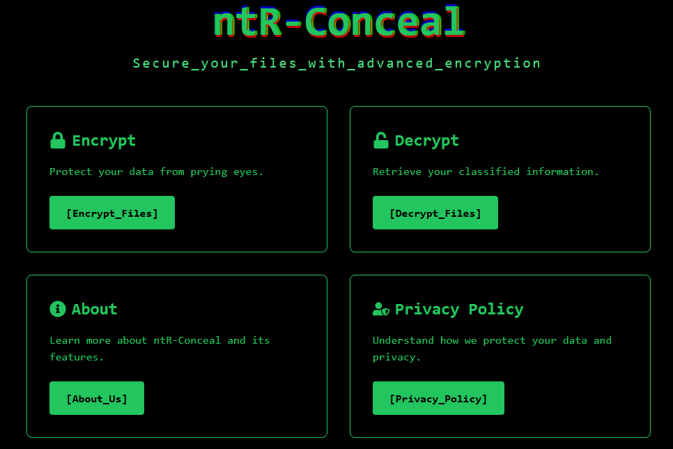

# ntR-Conceal

**ntR-Conceal** is a free, browser-based tool for AES encryption and decryption. It allows users to securely encrypt files directly in their browser without needing to download any software, ensuring data remains private and offline.

## Key Features

- **AES Encryption & Decryption**: Securely encrypt and decrypt files using Advanced Encryption Standard (AES) in your browser.
- **Offline Usage**: Operate entirely within your browser without an internet connection.
- **Privacy First**: No data tracking, logging, or external dependencies.

## Usage

Visit [ntR-Conceal](https://ntr-conceal.vercel.app/) to start encrypting or decrypting your files with AES encryption.

## Contributing

We welcome contributions! Please fork the repository, create a new branch, and submit a pull request.

## License

This project is licensed under the MIT License. See the [LICENSE](LICENSE) file for details.

## Contact

For questions or feedback, visit the [issues page](https://github.com/bishwassagar/ntR-Conceal/issues).
